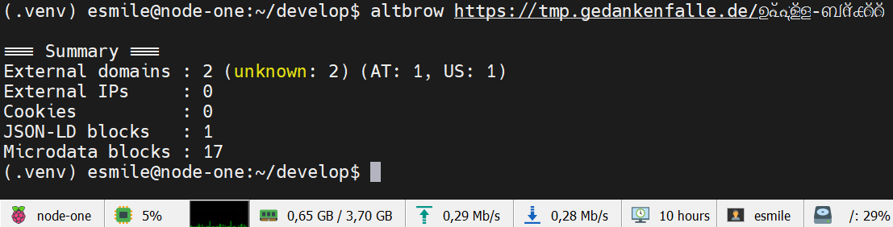

# Altbrow

Alternative crawler-like browser for a deep look into a website's semantic structure and external dependencies.
Includes a provider system for domain and IP classification via inline lists, local files, remote feeds, and DNS resolvers.

> Alpha version — built with AI assistance.

## Goals

Rapid review and evaluation of a website based on publicly available information: semantic content, formal structure, and exportable data for further analysis.

## Usage

### Install

#### linux user

```
# preparation and install
sudo apt install python3-pip
sudo apt install python3.12-venv
python3 -m venv .venv
source .venv/bin/activate

pip install https://github.com/gesmile/altbrow/releases/download/v0.1.1rc3/altbrow-0.1.1rc3-py3-none-any.whl

# configuration and renew cache
altbrow -v --validate-config
vi ~/.altbrow/altbrow.toml
vi ~/.altbrow/provider.toml

altbrow --validate-config
altbrow --build-cache

# usage
altbrow -vv <URL>
altbrow --no-cert-check --client-profile browser <URL>
altbrow -f json | jq -c '.signals.external_domains[] | {domain: .value, geo, occurrence }'
```

#### inside repository

```bash
pip install -e .
```

### CLI

```

usage: altbrow [-h] [-V] [--config CONFIG] [-o OUTPUT] [-f {text,yaml,json}] [-v] [--client-profile {passive,browser,consented}] [--no-cert-check] [--validate-config] [--build-cache] [--debug] [--log-file PATH]
               [url]
```

### Config discovery

1) --config /etc/altbrow.toml   →  /etc/provider.toml        (explicit)
2) ~/.altbrow/altbrow.toml      →  ~/.altbrow/provider.toml  (user)
3) ./altbrow.toml               →  ./provider.toml           (portable)

If no config exists, defaults are generated in `~/.altbrow/` on first run.

> Cache size: up to ~0.5 GB with full remote provider lists enabled.


## Exit Codes

| Code | Meaning               |
|------|-----------------------|
| 0    | Success               |
| 1    | Unhandled exception   |
| 2    | CLI usage error       |
| 3    | Config error          |
| 4    | Network / TLS error   |
| 5    | HTTP error (4xx/5xx)  |


## Provider System

Classifies domains and IPs using configurable providers: inline lists, local files, remote blocklists, DNS resolvers, and GeoIP databases.

### Categories

Each enabled provider requires at least one enabled category.
`name = "string"` is optional in all sections — TOML key is used as fallback.

#### 8 regular categories

| Category    | Description                                              |
|-------------|----------------------------------------------------------|
| `ads`       | Advertising networks and ad delivery                     |
| `analytics` | User behaviour measurement and reporting                 |
| `cdn`       | Content delivery networks and static asset hosting       |
| `malware`   | Malware, phishing, known hostile domains                 |
| `social`    | Social networks, dating, gambling, adult content         |
| `suspicious`| Unverified or potentially hostile                        |
| `telemetry` | Error reporting, performance monitoring, device telemetry|
| `tracking`  | Cross-site user tracking and profiling                   |

#### 3 special categories

| Category        | Description                                          |
|-----------------|------------------------------------------------------|
| `local`         | RFC1918, localhost, loopback, your domains           |
| `infrastructure`| Web standards, semantic namespaces, DNS resolvers    |
| `unknown`       | default if no provider hit                           |

### Provider schema

```toml

[provider.name]
name            = "Human readable label"     # optional
location        = "local|inline|remote|dns"
type            = "ip|domain"
enabled         = true|false
subdomain_match = true|false                 # optional, default: true

[[provider.name.category]]
name    = "Human readable label"             # optional
enabled = true|false                         # optional, default: true
tier    = <int>                              # optional, inline/local default: 1, dns/remote default: 2
mapping = ["<category>"]                     # one or more regular or special categories

# location = "inline" — domain or IP/CIDR list directly in config
source = ["example.com", "cdn.example.net"]
source = ["192.168.1.0/24", "10.0.0.1"]

# location = "local" — file path relative to provider.toml or absolute
source = ["./blocklist.txt"]
source = ["C:\\Windows\\System32\\drivers\\etc\\hosts"]

# location = "remote" — HTTP/HTTPS URL
source = ["https://example.com/list.txt"]

# location = "dns" — resolver IPs per category, sinkhole (= fake answer) required
source   = ["208.67.222.222", "208.67.220.220"]
sinkhole = ["146.112.61.104", "::ffff:146.112.61.104"]

```

#### GeoIP provider (MaxMind GeoLite2)

GeoIP uses `location = "local"` or `location = "remote"` with `mapping = ["geoip"]`.
Processed only during `--build-cache` for updates. Requires free registration at MaxMind.

```toml

[provider.maxmind]
location = "local"
type     = "ip"
enabled  = true

[[provider.maxmind.category]]
name    = "ASN"
mapping = ["geoip"]
source  = ["./GeoLite2-ASN_*.tar.gz"]   # glob, newest match is used for update

```

## Example

```bash

altbrow -v tmp.gedankenfalle.de/html5

=== Summary ===
External domains : 25 (infrastructure: 9, local: 1, malware: 1, telemetry: 2, unknown: 12) (US: 20, DE: 3, AT: 1, IE: 1)
External IPs     : 0
Cookies          : 0
JSON-LD blocks   : 0
Microdata blocks : 2

=== External Domains ===
FIRST_PARTY  TARGET     tmp.gedankenfalle.de             local           [AT AS197540 netcup GmbH]
EXTERNAL     LINK_ONLY  creativecommons.org              unknown         [US AS13335 Cloudflare, Inc.]
EXTERNAL     LINK_ONLY  developer.mozilla.org            infrastructure  [DE/Munich AS54113 Fastly, Inc.]
EXTERNAL     LINK_ONLY  rdflib.readthedocs.io            malware         [US AS13335 Cloudflare, Inc.]
EXTERNAL     LINK_ONLY  schema.org                       infrastructure  [US AS15169 Google LLC]
EXTERNAL     LINK_ONLY  www.w3.org                       infrastructure  [US AS13335 Cloudflare, Inc.]
...

external domains classified by provider category and GeoIP — with one false positive:
`rdflib.readthedocs.io` as `malware` is NOT true.

```

### UTF8 enabled


