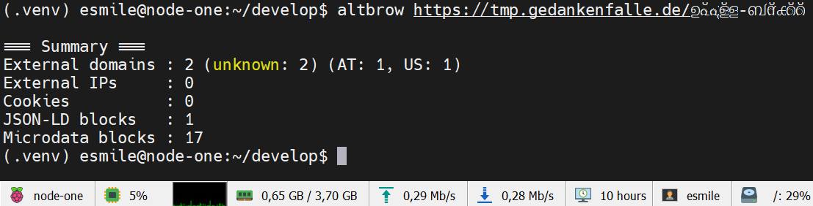

# Altbrow

Alternative crawler-like browser for a deep look into a website's semantic structure and external dependencies.   
Includes a provider system for domain and IP classification via inline lists, local files, remote feeds, and DNS resolvers   
— with structured JSON output.

Pipe it through **jq** to surface exactly what you're looking for.

> Alpha version — built with AI assistance.

## Goals

Rapid review and evaluation of a website based on publicly available information: semantic content, formal structure, and exportable data for further analysis.

## Usage

### Install

#### Linux user

```bash
# preparation on Debian/Ubuntu
sudo apt install python3-pip python3.12-venv
python3 -m venv .venv
source .venv/bin/activate

# download wheel from https://github.com/gesmile/altbrow/releases
pip install altbrow-<version>-py3-none-any.whl
```

#### Inside repository

```bash
pip install -e .
```

### First run

```bash
# generate default config in ~/.altbrow/
altbrow --validate-config

# edit config and provider list
vi ~/.altbrow/altbrow.toml
vi ~/.altbrow/provider.toml

# rebuild provider cache after provider.toml changes
altbrow --build-cache

# analyse a URL
altbrow <URL>
altbrow -vv <URL>

# bypass invalid certs or bot protection
altbrow --no-cert-check --client-profile browser <URL>
```

### JSON output with jq

```bash
# category, country and occurrence per domain
altbrow -f json <URL> | jq -c '.signals.domains[] | {domain: .value, cat, country: .ip.geo.country, occ}'

# see all provider hits per domain
altbrow -f json <URL> | jq -c '.signals.domains[] | {domain: .value, cats: [.categories[] | "\(.provider):\(.name)"] | join(", ") } + .occ'

# see unique categories per domain
altbrow -f json <URL> | jq -c '.signals.domains[] | {domain: .value, cat, cats: [.categories[].category] | unique, occ: .occ}'
```

### CLI

```
usage: altbrow [-h] [-V] [--config CONFIG] [-o OUTPUT] [-f {text,yaml,json}] [-v]
               [--client-profile {passive,browser,consented}] [--no-cert-check]
               [--validate-config] [--build-cache] [--debug] [--log-file PATH]
               [url]
```

### Config file discovery

```
1) --config /etc/altbrow.toml   →  /etc/provider.toml        (explicit mode)
2) ~/.altbrow/altbrow.toml      →  ~/.altbrow/provider.toml  (user mode)
3) ./altbrow.toml               →  ./provider.toml           (portable mode)
```

If no config exists, defaults are generated in `~/.altbrow/` on first run.  
Cache and GeoIP DB files are always placed next to the active config file.

> Cache size: up to ~0.5 GB with full remote provider lists enabled (`.altbrow.cache`).

## Provider System

Classifies domains and IPs using configurable providers: inline lists, local files, remote blocklists, DNS resolvers, and GeoIP databases.

See [docs/provider.md](docs/docs/provider.md) for the full provider schema, all file formats (plain list, hosts file, CSV/TSV, ABP filter, browser bookmarks), and configuration reference.

### Categories

| Category        | Description                                                  |
|-----------------|--------------------------------------------------------------|
| `ads`           | Advertising networks and ad delivery                         |
| `analytics`     | User behavior measurement and reporting                      |
| `cdn`           | Content delivery networks and static asset hosting           |
| `malware`       | Malware, phishing, known hostile domains                     |
| `social`        | Social networks, dating, gambling, adult content             |
| `suspicious`    | Unverified or potentially hostile                            |
| `telemetry`     | Error reporting, performance monitoring, device telemetry    |
| `tracking`      | Cross-site user tracking and profiling                       |
| `local`         | RFC1918, localhost, loopback, your own domains               |
| `infrastructure`| Web standards, semantic namespaces, DNS resolvers            |
| `unknown`       | Default if no provider matched                               |


## Exit Codes

See [docs/exitcodes.md](docs/docs/exitcodes.md) for the full reference including implementation status.

## Example

```bash
altbrow -v example.com

=== Summary ===
Connection       : HTTPS · HTTP/1.1 (h:11) · TLS 1.3 (TLS_AES_256_GCM_SHA384)
External domains : 2 (ads: 1, social: 1) (US: 2)
External IPs     : 0
Cookies          : 0
JSON-LD blocks   : 0
Microdata blocks : 0

=== Transport ===
  HTTPS · HTTP/1.1 (h:11) · TLS 1.3 (TLS_AES_256_GCM_SHA384)

=== External Domains ===
  FIRST_PARTY  TARGET     example.com                              ads             [US AS13335 Cloudflare, Inc.]
  EXTERNAL     LINK       iana.org                                 social          [US AS40528 ICANN]
```

### UTF8 enabled


